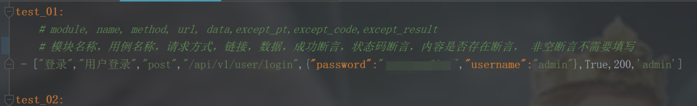
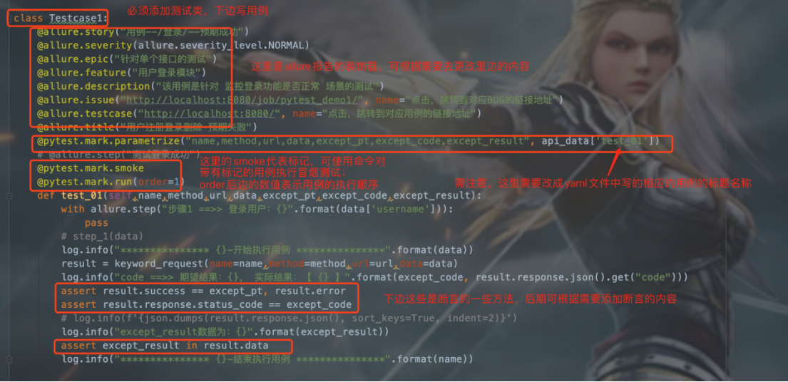
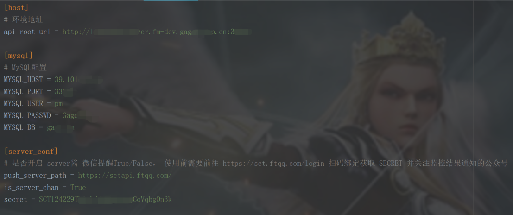
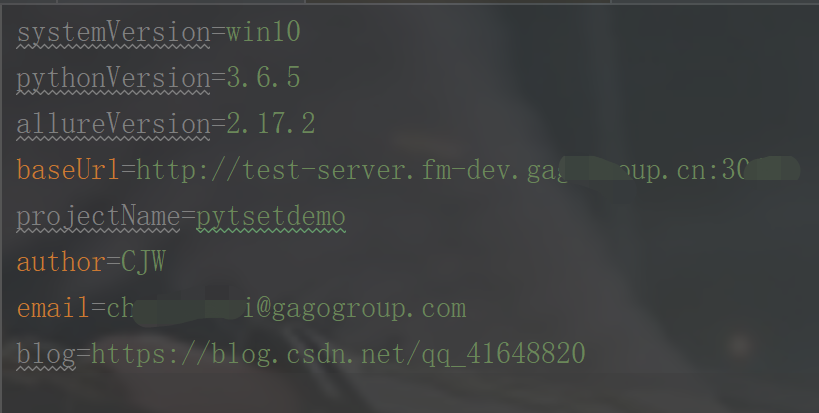
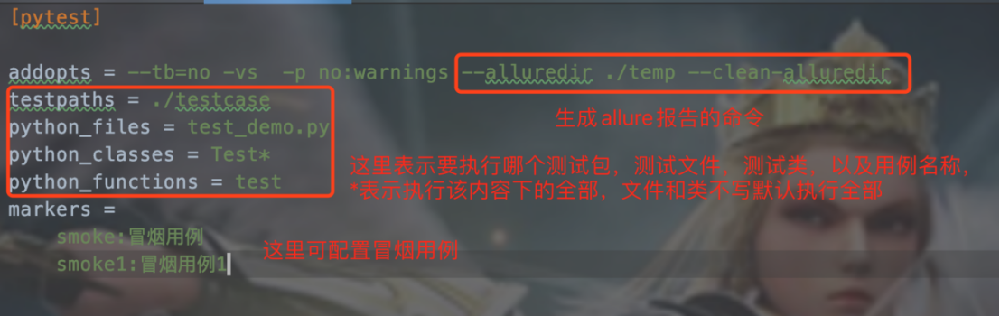
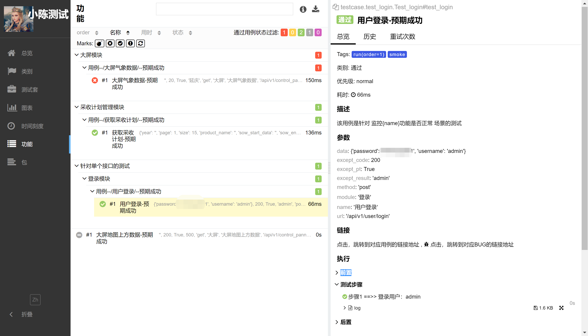

# pytestDemo

本项目实现接口自动化的技术选型：**Python+Requests+Pytest+YAML+Allure** ，主要是针对本人的一个接口项目来开展的，通过 Python+Requests 来发送和处理HTTP协议的请求接口，使用 Pytest 作为测试执行器，使用 YAML 来管理测试数据，使用 Allure 来生成测试报告，最后可根据测试结果判断是否进行微信公众号通知，企业微信小程序/群机器人通知，邮件通知。


## 项目说明

本项目在实现过程中，把整个项目拆分成请求方法封装、HTTP接口封装、关键字封装、测试用例等模块。

首先利用Python把HTTP接口封装成Python接口，接着把这些Python接口组装成一个个的关键字，再把关键字组装成测试用例，而测试数据则通过YAML文件进行统一管理，然后再通过Pytest测试执行器来运行这些脚本，并结合Allure输出测试报告，并通过微信和邮件的方式进行推送测试结果。

当然，如果感兴趣的话，还可以再对接口自动化进行Jenkins持续集成。

## 项目部署

- 全部项目源码来源于此项目：https://github.com/chenjiaweigit/pytestdemo 
- Git仓库下载：https://github.com/chenjiaweigit/pytestdemo.git 
- 安装项目依赖：在根目录下找到 [requirements.txt](requirements.txt)文件，然后通过 pip 工具安装 requirements.txt 依赖，执行命令：
```pip3 install -r requirements.txt```
- 安装allure：如果是直接使用jenkins上的插件，并不需要下载安装，如果想在本地查看，则需要自行安装：
  
  1.首先是要安装好jdk的电脑上，运行java、javac这些命令都没有问题，要不安装allure时会报错
  
  2.Allure官网下载：http://allure.qatools.ru/   
  
  Allure github下载：https://github.com/allure-framework/allure2 
  
  3.下载到本地解压并配置环境变量即可

## 项目结构

- common ====>> 各种工具类
- config ====>> 配置文件
- data ====>> 测试数据文件管理
- operation ====>> requests请求方法封装，关键字封装
- pytest.ini ====>> pytest配置文件
- requirements.txt ====>> 相关依赖包文件
- testcases ====>> 测试用例

## 使用操作
- 新增测试用例数据，yaml文件按照格式添加即可，具体格式参考截图内注释
- 
- 添加测试用例，可在当前演示文件[test_login.py](https://github.com/chenjiaweigit/pytestdemo/blob/ff1cb73fe3a1a4e2914dad05aae01dba7e8850b0/testcase/test_login.py)下添加，也可自行新建一个.py文件然后写用例，格式按照 [test_login.py](https://github.com/chenjiaweigit/pytestdemo/blob/ff1cb73fe3a1a4e2914dad05aae01dba7e8850b0/testcase/test_login.py) 进行添加即可，具体参考 [test_login.py](https://github.com/chenjiaweigit/pytestdemo/blob/ff1cb73fe3a1a4e2914dad05aae01dba7e8850b0/testcase/test_login.py) 模块已做详细注释
- 注意：类的命名开头必须是大写的“Test”，用例的命名必须是“test_”，测试文件必须以”test_”开头或者“_test”结尾，如（test_a.py或者a_test.py）
- 注意：如果是接口之间有依赖需要鉴权的，请把登录用例执行顺序放在第一条，不然后边的会获取不到鉴权码而报错;不同的项目研发代码编写格式不同，所以token无法统一获取，需根据实际情况进行提取，
            目前有返回json字典提取和正则提取，自行选择一种进行操作，不需要可忽略...,具体设置在[keyword_request.py](keyword_request.py)
- 
- settings.ini配置，此处更改为自己的环境
- 
- environment.properties为Allure报告中的环境配置显示，可根据个人情况进行配置，不需要的可忽略
- 
- Pytest.ini配置
- 
## 测试报告效果展示

- 环境配置好以后，进入 [run.py](https://github.com/chenjiaweigit/pytestdemo/blob/ff1cb73fe3a1a4e2914dad05aae01dba7e8850b0/run.py) 文件执行该文件即可运行该框架，然后报告会生成在 [report](https://github.com/chenjiaweigit/pytestdemo/tree/dev/report) 该文件夹下，用浏览器打开index.html即可
- 注意：需要提前配置allure的环境，才可以使用命令生成allure报告，不然执行命令会报错

  最终看到的allure报告效果图如下



